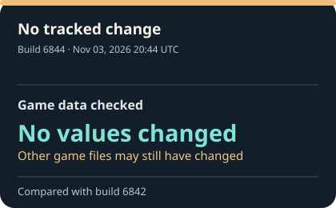
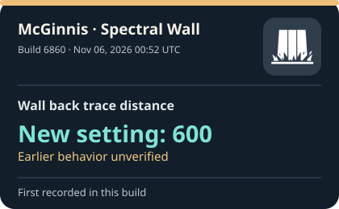
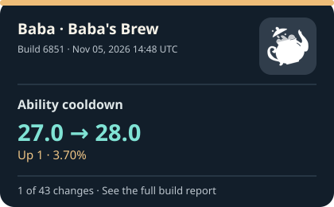
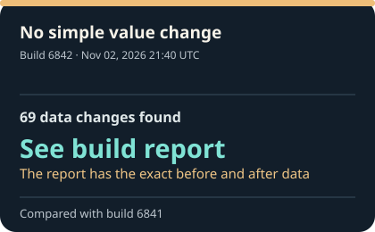
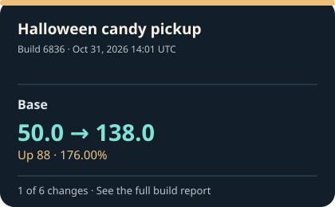
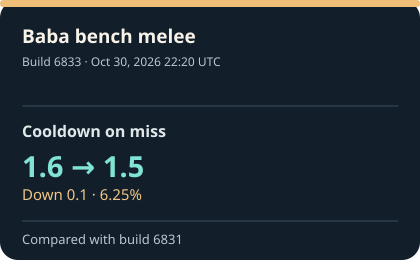

# Deadlock build tracker

See what changed in Deadlock, one update at a time. Each build has a short explanation, a change card, and exact before-and-after values when both are known. [Find a character or mode in the build history](reports/index.md).

These are changes in extracted files. A value changing in a file does not, on its own, tell us how it felt or worked in a match.

**[Recent updates](reports/recent-changes.md) · [Browse by character or mode](reports/index.md) · [Latest report](reports/latest.md) · [Street Brawl](reports/street-brawl.md)**

<!-- RECENT_CHANGES_START -->
## What changed in Deadlock?

**Latest build recorded:** [6861](reports/builds/6861.md) on Nov 11, 2026 at 21:38 UTC.

**Tracker check:** Scheduled every five minutes. [See the most recent check and its time](https://github.com/jordanbenjaminmitchell/deadlock-tracker/actions/workflows/track.yml). GitHub may start a check late.

**History covered:** Oct 25, 2025–Nov 11, 2026 across 409 saved builds. [Browse by month](reports/index.md#updates-by-month).

### Latest update

No value changed in the game data this tracker watches.

[See everything found in build 6861](reports/builds/6861.md) · [Check the source](https://github.com/SteamTracking/GameTracking-Deadlock/commit/82735ebcc9c89d1b3f6b3262c23c9580798ad362).

### Previous updates

#### Build 6860 · Nov 06, 2026 00:52 UTC

McGinnis · Spectral Wall — Wall back trace distance is now listed as **600**. There is no confirmed earlier value.

- **McGinnis · Spectral Wall — Wall back trace distance**: new setting **600**

[See all changes in build 6860](reports/builds/6860.md) · [Check the source](https://github.com/SteamTracking/GameTracking-Deadlock/commit/3cfcaf9ed882f2d85cc5d915315f754790b8ffb7).

#### Build 6851 · Nov 05, 2026 14:48 UTC

Baba · Baba's Brew — Ability cooldown changed from **27.0** to **28.0**.

Key values in this update:

- **Baba · Baba's Brew — Ability cooldown**: 27.0 → **28.0** (Up 1 · 3.70%)
- **Rat King · Scrap Grenade — Melee minimum fuse remaining**: 0.4 → **0.25** (Down 0.15 · 37.50%)
- **Citadel weapon nurse set — Bullet damage**: 13.372 → **14.442** (Up 1.07 · 8.00%)
- **Citadel weapon ratking set — Bullet damage**: 5.7 → **5.8** (Up 0.1 · 1.75%)
- **Citadel weapon ratking set — I clip size**: 24 → **26** (Up 2 · 8.33%)

[See all changes in build 6851](reports/builds/6851.md) · [Check the source](https://github.com/SteamTracking/GameTracking-Deadlock/commit/87a62330fc2bff904c29d0ed381a15a50d7ba9ae).

#### Build 6842 · Nov 02, 2026 21:40 UTC

This build changed data without a simple value to highlight.

[See all changes in build 6842](reports/builds/6842.md) · [Check the source](https://github.com/SteamTracking/GameTracking-Deadlock/commit/fc53d8b267db6949b03d3fdb975dff4c9028f77b).

#### Build 6836 · Oct 31, 2026 14:01 UTC

Halloween candy pickup — Base changed from **50.0** to **138.0**.

Key values in this update:

- **Halloween candy pickup — Base**: 50.0 → **138.0** (Up 88 · 176.00%)
- **Halloween candy pickup — Collection method**: new setting **VacuumTrigger**

[See all changes in build 6836](reports/builds/6836.md) · [Check the source](https://github.com/SteamTracking/GameTracking-Deadlock/commit/054a283124561dedd79df03fe82fcf5d99806680).

#### Build 6833 · Oct 30, 2026 22:20 UTC

Baba bench melee — Cooldown on miss changed from **1.6** to **1.5**.

- **Baba bench melee — Cooldown on miss**: 1.6 → **1.5** (Down 0.1 · 6.25%)

[See all changes in build 6833](reports/builds/6833.md) · [Check the source](https://github.com/SteamTracking/GameTracking-Deadlock/commit/b18c406df07927fc6041d5d010241e7e88b8323b).

Last five changes with a verified before and after

These are individual values, so several can come from one build.

- **Baba · Baba's Brew — Ability cooldown**: 27.0 → **28.0** (Up 1 · 3.70%) · Nov 05, 2026 14:48 UTC · Build 6851 ([card](reports/infographics/recent/6851-8eb2ac7a7974.svg); [full update](reports/builds/6851.md))
- **Rat King · Scrap Grenade — Melee minimum fuse remaining**: 0.4 → **0.25** (Down 0.15 · 37.50%) · Nov 05, 2026 14:48 UTC · Build 6851 ([card](reports/infographics/recent/6851-ef47cb8c0353.svg); [full update](reports/builds/6851.md))
- **Citadel weapon nurse set — Bullet damage**: 13.372 → **14.442** (Up 1.07 · 8.00%) · Nov 05, 2026 14:48 UTC · Build 6851 ([card](reports/infographics/recent/6851-3a2b0b9100f3.svg); [full update](reports/builds/6851.md))
- **Citadel weapon ratking set — Bullet damage**: 5.7 → **5.8** (Up 0.1 · 1.75%) · Nov 05, 2026 14:48 UTC · Build 6851 ([card](reports/infographics/recent/6851-9fa0a0deb57e.svg); [full update](reports/builds/6851.md))
- **Citadel weapon ratking set — I clip size**: 24 → **26** (Up 2 · 8.33%) · Nov 05, 2026 14:48 UTC · Build 6851 ([card](reports/infographics/recent/6851-8f0158f01161.svg); [full update](reports/builds/6851.md))

<!-- RECENT_CHANGES_END -->

## How to read the changes

The tracker is scheduled to look for a new Deadlock build every five minutes. GitHub may start a scheduled check late. The page changes when [SteamTracking](https://github.com/SteamTracking/GameTracking-Deadlock) records a newer build. [See the latest check](https://github.com/jordanbenjaminmitchell/deadlock-tracker/actions/workflows/track.yml). A new setting is shown without a guessed old number. Every build report links to its source data.

Names come from the game data; some may be development labels. Each report links to the SteamTracking commit it came from. Open **Check the exact source values** in a report if you want the original data behind the plain-language text. The tracker covers selected game data, so a build can still contain changes outside these reports.

The icons on hero and ability cards are [actual Deadlock artwork](assets/icons/SOURCES.md). If matching art is unavailable, the card shows the change without an image.

## Examples from the archive

- [Street Brawl, build 6794](reports/builds/6794.md): the fifth buy-time value changed **65 → 50**, a decrease of 15.
- [Violet's Living Ink, build 6819](reports/builds/6819.md): **15.0** first appeared as a minimum stroke-distance setting. [The source investigation](docs/source-investigation-6819.md) explains why no earlier number can be verified.

[How the tracker works and how to run it](docs/technical.md)
