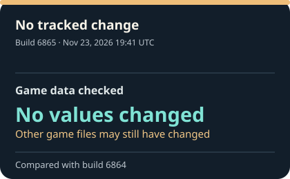
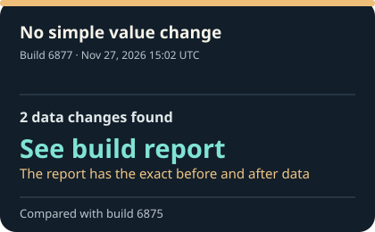
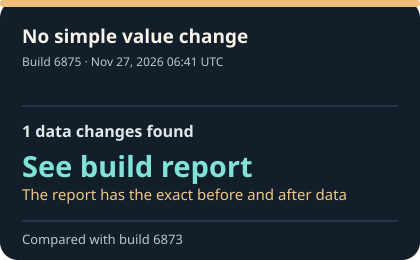

## What changed in Deadlock?

**Latest build recorded:** [6882](builds/6882.md) on Nov 28, 2026 at 02:35 UTC.

**Tracker check:** Scheduled every five minutes. [See the most recent check and its time](https://github.com/jordanbenjaminmitchell/deadlock-tracker/actions/workflows/track.yml). GitHub may start a check late.

**History covered:** Oct 25, 2025–Nov 28, 2026 across 421 saved builds. [Browse by month](index.md#updates-by-month).

### Latest update

Baba — Bullet armor damage reduction changed from **-7.0** to **-4.0**.

[See everything found in build 6882](builds/6882.md) · [Check the source](https://github.com/SteamTracking/GameTracking-Deadlock/commit/09f9017193cc65084ef86aff45b7b3458fb2db0c).

### Previous updates

#### Build 6880 · Nov 27, 2026 17:03 UTC

This build changed data without a simple value to highlight.

[See all changes in build 6880](builds/6880.md) · [Check the source](https://github.com/SteamTracking/GameTracking-Deadlock/commit/38f122b60950338aacba5d62fabfd83a7d5bc3fb).

#### Build 6877 · Nov 27, 2026 15:02 UTC

This build changed data without a simple value to highlight.

[See all changes in build 6877](builds/6877.md) · [Check the source](https://github.com/SteamTracking/GameTracking-Deadlock/commit/d2920730705cecb154a751dc6959787b98992580).

#### Build 6875 · Nov 27, 2026 06:41 UTC

This build changed data without a simple value to highlight.

[See all changes in build 6875](builds/6875.md) · [Check the source](https://github.com/SteamTracking/GameTracking-Deadlock/commit/6d9ccf2531f8b097e7b97908765eda6f1b501de1).

#### Build 6871 · Nov 26, 2026 17:24 UTC

Violet — Maximum health changed from **710.0** to **650.0**.

Key values in this update:

- **Violet — Maximum health**: 710.0 → **650.0** (Down 60 · 8.45%)
- **Holliday — Maximum health**: 780.0 → **715.0** (Down 65 · 8.33%)
- **Abrams — Maximum health**: 800.0 → **735.0** (Down 65 · 8.12%)
- **Baba — Maximum health**: 780.0 → **715.0** (Down 65 · 8.33%)
- **Base — Maximum health**: 780.0 → **715.0** (Down 65 · 8.33%)

[See all changes in build 6871](builds/6871.md) · [Check the source](https://github.com/SteamTracking/GameTracking-Deadlock/commit/77b862290ad3050cafd2e9c3f47e0532e9d6dcfd).

Last five changes with a verified before and after

These are individual values, so several can come from one build.

- **Baba — Bullet armor damage reduction**: -7.0 → **-4.0** (Up 3) · Nov 28, 2026 02:35 UTC · Build 6882 ([card](infographics/recent/6882-6476cb13c445.svg); [full update](builds/6882.md))
- **Baba · Threadsap — Ability cooldown**: 28.0 → **26.0** (Down 2 · 7.14%) · Nov 28, 2026 02:35 UTC · Build 6882 ([card](infographics/recent/6882-656826c19670.svg); [full update](builds/6882.md))
- **Baba bench melee — Charge time**: 0.55 → **0.45** (Down 0.1 · 18.18%) · Nov 28, 2026 02:35 UTC · Build 6882 ([card](infographics/recent/6882-26d127780a24.svg); [full update](builds/6882.md))
- **Baba · Granny Long Legs — Ability cooldown**: 32 → **30** · Nov 28, 2026 02:35 UTC · Build 6882 ([card](infographics/recent/6882-80494ea0a579.svg); [full update](builds/6882.md))
- **Baba · Threadsap — Magic damage per bullet**: 12 → **18** · Nov 28, 2026 02:35 UTC · Build 6882 ([card](infographics/recent/6882-f1bab7468888.svg); [full update](builds/6882.md))

